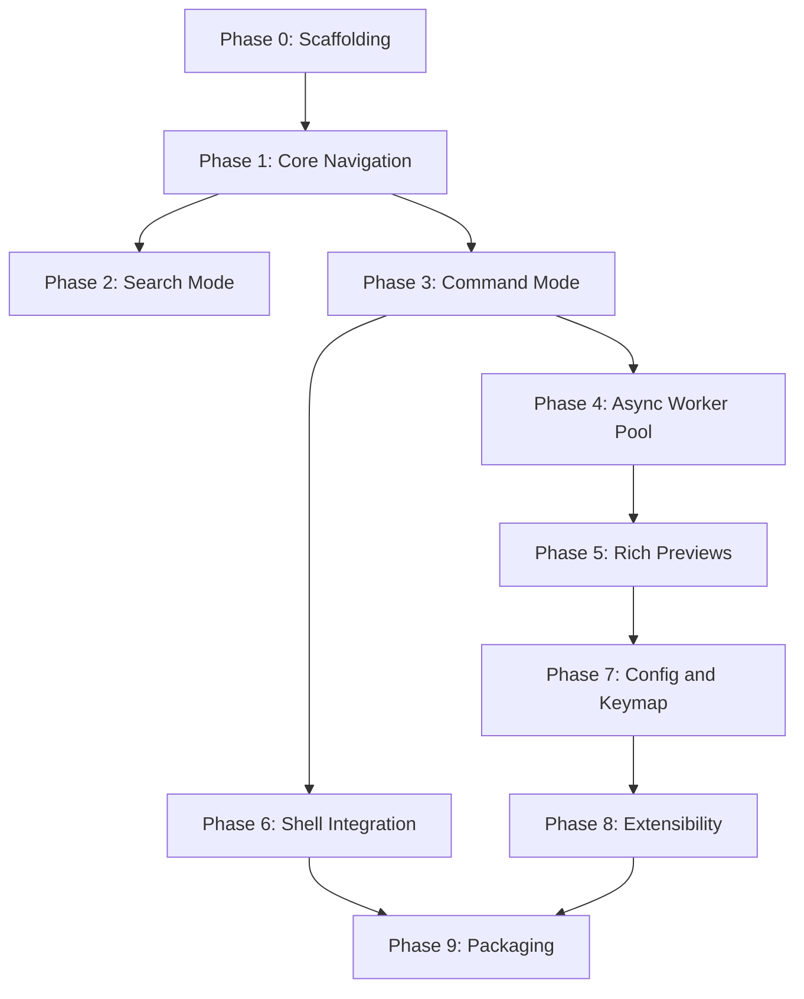

# Trail — Implementation Plan

## Purpose & Sources

This plan turns the three project documents into a single, phase-by-phase execution plan:

- **`trail.md`** — product spec (*what* Trail does)
- **`trail-architecture.md`** — tech stack, process model, thread responsibilities (*how it's structured*)
- **`trail-implementation-guide.md`** — file layout, data types, function signatures, and the original 10-phase build table (*how it's built*)

Phase numbering below (0–9) matches `trail-implementation-guide.md` §10 exactly, so this plan stays traceable back to the source doc. Each phase is expanded from a one-line scope into concrete tasks, file-level ownership, dependencies, exit criteria, and testing. The plan adds an execution-strategy layer (grouping, parallelization, a dependency graph), a consolidated testing view, and a decision log for the handful of things the source docs leave genuinely open.

---

## Confirmed Tech Stack

| Concern | Crate options | v1 pick | Purpose |
|---|---|---|---|
| Terminal UI | `ratatui` | `ratatui` | Widget rendering, layout, the three-panel interface |
| Terminal backend | `crossterm` | `crossterm` | Raw mode, alternate screen, cross-platform input events |
| Async runtime | `tokio` | `tokio` | Runs the background worker pool without blocking the UI |
| Fuzzy filtering | `nucleo` | `nucleo` | Incremental fuzzy filter in Search Mode |
| Syntax highlighting | `syntect` / `tree-sitter-highlight` | `syntect` | Text file preview |
| Git status/branch | `gix` / `git2` | `gix` | Repo indicators, branch name, optional status |
| Filesystem watching | `notify` | `notify` | Automatic refresh after filesystem changes |
| Image handling | `image` + `ratatui-image` | both | Metadata/dimensions always; pixel preview if terminal supports Kitty/iTerm2/Sixel |
| Plugin scripting | `mlua` (Lua) / `extism` (WASM) | `mlua` | User-defined commands, custom preview providers |
| Config | `serde` + `toml` | both | Keybindings, theme, extension points |
| CLI parsing | `clap` | `clap` | Invocation flags (`--cwd-file`, `--config`, start path) |

v1 picks are already resolved in the source guide (see **Decision Log** below for the reasoning carried forward). `git2` and `extism`/WASM remain the documented fallback paths if `gix` or `mlua` hit a hard limitation.

*Alternative stack noted in the architecture doc: Go + `bubbletea`/`lipgloss`, viable if the team prefers goroutines over `tokio` tasks. This plan assumes the Rust stack, as the implementation guide does; the module boundaries below hold either way, only crate names would change.*

---

## Project Layout (Reference)

```
trail/
├── Cargo.toml
├── src/
│   ├── main.rs               # entry point: parse CLI, init terminal, run event loop, teardown
│   ├── cli.rs                 # clap definitions: --cwd-file, --config, positional start path
│   ├── app/
│   │   ├── mod.rs
│   │   ├── state.rs            # AppState, Entry, EntryKind
│   │   ├── mode.rs             # Mode enum (Navigation / Search / Command)
│   │   ├── history.rs          # NavigationHistory (back/forward stack)
│   │   └── tabs.rs             # TabState, multi-tab support (extension)
│   ├── ui/
│   │   ├── mod.rs               # render(state) -> draws all three panels
│   │   ├── nav_panel.rs
│   │   ├── preview_panel.rs
│   │   ├── status_bar.rs
│   │   └── theme.rs             # resolves TOML theme -> ratatui Style objects
│   ├── input/
│   │   ├── mod.rs               # dispatch(key, state) -> Option<Action>
│   │   ├── keymap.rs            # default + user-configured key bindings
│   │   └── command_parser.rs    # Command Mode grammar: history, completion, validation
│   ├── actions/
│   │   ├── mod.rs               # Action enum + apply(action, state)
│   │   ├── fs_ops.rs             # rename/move/duplicate/delete/create file|dir
│   │   ├── clipboard.rs          # copy absolute/relative path, filename
│   │   └── shell_exec.rs         # suspend/resume subprocess execution
│   ├── preview/
│   │   ├── mod.rs
│   │   ├── provider.rs           # PreviewProvider trait + registry
│   │   ├── directory.rs
│   │   ├── text.rs
│   │   ├── binary.rs
│   │   └── image.rs
│   ├── workers/
│   │   ├── mod.rs                # WorkerMsg enum, spawn/dispatch helpers, mpsc plumbing
│   │   ├── git.rs
│   │   ├── fswatch.rs
│   │   ├── highlight.rs
│   │   └── image_decode.rs
│   ├── config/
│   │   ├── mod.rs
│   │   ├── schema.rs             # serde structs mirroring the TOML shape
│   │   └── default.toml
│   ├── plugin/
│   │   ├── mod.rs
│   │   └── lua_api.rs            # v1 scripting surface (Lua/mlua — see Decision Log)
│   └── session.rs                # writes --cwd-file on normal exit
├── shell/
│   ├── trail.bash
│   ├── trail.zsh
│   └── trail.fish
└── tests/
    ├── state_tests.rs
    ├── render_snapshot_tests.rs
    ├── command_parser_tests.rs
    └── fixtures/                 # sample dirs/files used by preview + filter tests
```

Every task in the phases below names the file(s) it owns from this tree, so ownership never has to be re-derived mid-implementation.

---

## Execution Strategy & Phase Dependencies

Phases group into four execution tracks. The grouping principle: **Phases 0–3 are a complete synchronous-only MVP; everything after layers in exactly the worker-pool or extension responsibilities the architecture doc assigned to the async side** — so no early work needs re-architecting later.

| Track | Phases | Rationale |
|---|---|---|
| **A — Synchronous core (MVP)** | 0 → 1 → 2 → 3 | UI-thread-only work; each phase is independently demoable; this track alone ships as a usable tool |
| **B — Async/worker layer** | 4 → 5 | Both depend on the `WorkerMsg`/generation-guard contract Phase 4 establishes; Phase 5 cannot start before it |
| **C — Environment integration** | 6 | Depends on Phase 1 (action system) and Phase 3 (`!`-shell grammar) — has no dependency on Track B |
| **D — Configurability & growth** | 7 → 8 → 9 | Config must precede plugins (bookmarks/hooks are wired through the config schema); packaging is last by necessity |

Track C shares no code-level dependency with Track B. Once Phase 3 lands, Phase 6 can proceed in parallel with Phases 4–5 if resourced separately — the one genuine parallelization opportunity in this plan. Every other phase boundary is a hard dependency and stays strictly sequential.



### Phase overview

| Phase | Scope | Depends on | Complexity* |
|---|---|---|---|
| 0 | Scaffolding | — | Low |
| 1 | Core navigation | 0 | Medium-High |
| 2 | Search Mode | 1 | Low-Medium |
| 3 | Command Mode | 1 | Medium |
| 4 | Async worker pool | 1, 3 | High |
| 5 | Rich previews | 4 | Medium-High |
| 6 | Shell integration | 1, 3 | Medium |
| 7 | Config & keymap | 3, 4, 5 | Low-Medium |
| 8 | Extensibility | 7 | Medium-High |
| 9 | Packaging & distribution | 6, 8 | Low-Medium |

*Complexity is relative sizing for staffing and sequencing discussions, not a calendar estimate.*

---

## Phase 0 — Scaffolding

**Scope:** Cargo project, `clap` CLI, raw-mode terminal init/teardown, empty three-panel layout.
**Depends on:** Nothing — first phase.
**Complexity:** Low

**Tasks**
- Initialize the Cargo project (`Cargo.toml`, `src/main.rs`) with the full dependency skeleton from the confirmed stack — even crates unused until later phases, so `Cargo.lock` stabilizes early.
- `cli.rs`: `clap` definitions for `--cwd-file`, `--config`, and a positional start path (both are consumed later, by Phase 6 and Phase 7 respectively, but the flags should exist from the start).
- Terminal lifecycle in `main.rs`: enter/exit raw mode and the alternate screen via `crossterm`. This is the same mechanism Phase 6's suspend/resume later reuses, so get the enter/exit pair right once here.
- Install a panic hook that restores cooked terminal mode before unwinding. A TUI that panics without this leaves the user's terminal broken — worth building in now rather than discovering it later.
- Empty three-panel layout: `ui/mod.rs::render()` draws `nav_panel`, `preview_panel`, and `status_bar` as blank bordered regions (files exist per the project layout, with placeholder bodies).
- Minimal event loop in `main.rs` with a single `q` binding that quits cleanly and restores the terminal.

**Deliverables:** A compiling, runnable binary with the full module skeleton in place.

**Exit criteria:**
> `trail` launches into an empty ratatui frame and quits cleanly on `q`.

**Testing:** Manual smoke test (launch, quit, confirm terminal state is restored to normal on both clean exit and `Ctrl-C`). CI: `cargo build` and `cargo clippy` clean.

---

## Phase 1 — Core Navigation

**Scope:** `AppState`, `Entry` listing, directory-first sort, Navigation Mode movement, enter/parent dir, synchronous directory + text preview.
**Depends on:** Phase 0.
**Complexity:** Medium-High — this phase establishes the core data model everything later builds on; get the shapes right here.

**Tasks**
- `app/state.rs`: define `AppState`, `Entry`, `EntryKind` (Dir/File/Symlink), `Mode` (all three variants — Navigation, Search, Command — even though only Navigation is functionally wired this phase), and `PreviewSlot` including its `generation: u64` field. The field exists now even though generation-guarding isn't exercised until Phase 4/5, so the state shape doesn't change later.
- Directory listing + directory-first sort. The spec requires directories before files but doesn't specify the tie-break within each group — default to alphabetical, case-insensitive (flagged again in the Decision Log).
- Hidden-file support: `is_hidden` flag on `Entry`, plus a toggle to show/hide them.
- `app/history.rs`: `NavigationHistory` back/forward stack.
- Navigation Mode key handling in `input/keymap.rs` + `input/mod.rs::dispatch`: `j`/`k`/arrows for movement, `l`/`Enter` to enter a directory, `h`/`Backspace` for parent directory, `gg`/`G` for top/bottom jump, `u`/`Ctrl-r` for history back/forward.
- Preserve current selection across re-entry into a directory where possible.
- `preview/provider.rs`: define the `PreviewProvider` trait and `PreviewRegistry` now, even though only two providers exist this phase — this is what lets Phase 5 add binary/image support without touching the trait contract.
- `preview/directory.rs`: synchronous directory preview (contents, file count, directory count, hidden files).
- `preview/text.rs`: synchronous text preview — **raw content and line numbers only, no syntax highlighting yet.** Highlighting is explicitly a Phase 5 deliverable in the source guide, so this phase intentionally stops short of it.
- `ui/status_bar.rs`: basic reflection of `cwd`, mode, and entry count (git branch is added in Phase 4).
- Note on the editor-open action: `l`/`Enter` is bound for directory entry now; opening a file in `$EDITOR` shares the same key but its actual subprocess mechanism isn't implemented until Phase 6 — treat it as a no-op or stub for files until then.

**Deliverables:** A full read-only browsing experience over the synchronous path only.

**Exit criteria:**
> Can browse a real filesystem tree with live preview, no async yet.

**Testing:** `state_tests.rs` — selection movement at list boundaries (top/bottom edge cases), directory-first sort correctness, history push/pop behavior.

---

## Phase 2 — Search Mode

**Scope:** `nucleo` integration, incremental filter, reorder-on-type.
**Depends on:** Phase 1 (needs `Entry` listing and the nav panel to exist).
**Complexity:** Low-Medium

**Tasks**
- Integrate the `nucleo` fuzzy-matching crate.
- Wire `Mode::Search { query, matches }` (already shaped in Phase 1) to a real matcher: `matches` holds indices into `state.entries`.
- Keymap: `/` enters Search Mode.
- On each keystroke, re-run the fuzzy match against `state.entries`, update `matches`, and continuously reorder by score.
- Selection auto-updates to the top match as the filter changes.
- `Esc` exits Search Mode and restores the complete, unfiltered directory listing.
- `ui/nav_panel.rs`: render `state.filter.matches` when present, otherwise `state.entries`.
- `ui/status_bar.rs`: reflect the active filter string.

**Deliverables:** A live fuzzy filter fully wired into the nav panel and status bar.

**Exit criteria:**
> `/` filters current dir live, `Esc` restores full listing.

**Testing:** Filter match/reorder correctness in `state_tests.rs`. The architecture doc keeps fuzzy filtering synchronous on the UI thread because it's "fast enough not to need offloading" — that assumption is worth a manual perf sanity check against a very large directory as part of this phase's exit testing, rather than treated as permanently true.

---

## Phase 3 — Command Mode

**Scope:** Parser grammar, `:mkdir`/`:touch`/`:rename`, history + completion.
**Depends on:** Phase 1 (needs `AppState`/`Entry`). Benefits from Phase 2 existing but is not blocked by it — Phases 2 and 3 can run in either order, or in parallel, once Phase 1 lands.
**Complexity:** Medium

**Tasks**
- `input/command_parser.rs`: grammar for `:mkdir <name>`, `:touch <name>`, `:rename <new-name>`, `:mv <dest>`, `:cp <dest>`, `:git <subcommand...>`, `:set <key> <value>`, and `!<shell command>`. Note: `:git` and `:set` are accepted and validated syntactically here even though their real backing (the git worker, the config schema) doesn't land until Phases 4 and 7 — the parser should recognize the grammar now, and later phases wire it to live behavior.
- Keymap: `:` enters Command Mode.
- History: a ring buffer, persisted across sessions to a small cache file.
- Tab-completion: path completion for `mv`/`cp` targets, verb completion for the leading token.
- Validation surfaced in the status bar: reject `:rename` containing `/`, reject empty `:mkdir`, and similar guards.
- `actions/fs_ops.rs`: real filesystem mutation logic for rename/move/duplicate/delete/create file/create directory, invoked once a command validates.
- `actions/clipboard.rs`: copy absolute path, relative path, and filename, bound to `ya`/`yr`/`yn`.
- Confirmation flow for `dd` (delete), per the spec's "with confirmation" note.
- Wire a refresh of the current view after any `fs_ops` mutation. This covers self-initiated changes only — refreshing on *externally* triggered changes is Phase 4's job, once the filesystem watcher exists.

**Deliverables:** The full parameterized action set, working end-to-end for anything that doesn't require async workers.

**Exit criteria:**
> Parameterized actions work end-to-end with validation errors surfaced in the status bar.

**Testing:** `command_parser_tests.rs` — grammar coverage for valid and invalid `:mkdir`/`:rename`/`!`-prefixed input, plus completion and history behavior.

---

## Phase 4 — Async Worker Pool

**Scope:** `WorkerMsg` plumbing, git worker, fs watcher + debounce, generation-guard.
**Depends on:** Phase 1 (state shape) and Phase 3 (extends the self-initiated refresh hook to also cover external changes). Not dependent on Phase 2.
**Complexity:** High — this introduces the entire concurrency model. Getting the channel/generation contract right here is the highest-risk single phase in the plan, since Phase 5 builds directly on top of it.

**Tasks**
- `workers/mod.rs`: define the single `WorkerMsg` enum (`Git`, `FsChanged`, `Preview`, `ImageMeta` variants). This resolves the architecture doc's open question in favor of one enum over per-domain channels.
- Set up the `mpsc` channel between tokio worker tasks and the UI thread; a single receiver drained once per UI tick.
- Extend the `main.rs` event loop to `select!` across terminal input, the worker channel, and the fs-signal channel.
- `workers/git.rs`: `spawn_git_status(path, tx)` — computes the repo indicator, branch name, and (if enabled) per-file status; cached per directory, invalidated on `FsChanged` for that directory rather than recomputed every render.
- `workers/fswatch.rs`: wrap `notify`, watching `state.cwd` only, re-subscribing on directory change, debouncing bursts of events (e.g. a `git checkout`) into a single `WorkerMsg::FsChanged` after a quiet window — default 200ms (exposed as config in Phase 7).
- Populate `Option<GitDirState>` on `AppState` (already shaped since Phase 1).
- `ui/nav_panel.rs`: render git badges once the worker reports them.
- `ui/status_bar.rs`: render the current git branch.
- Generation-guard: `workers::merge()` compares any `WorkerMsg::Preview`/`ImageMeta` generation against `state.preview.generation` and drops the message if they don't match. Build this now even though the `Preview`/`ImageMeta` variants don't carry real content until Phase 5 — the merge path and the "increment generation on selection change" logic belong to this phase.
- Extend `fs_ops` refresh call sites so externally triggered `FsChanged` events also trigger a refresh, not just self-initiated mutations from Phase 3.

**Deliverables:** The async plumbing fully live; git status and external-change refresh both functional without blocking the UI thread.

**Exit criteria:**
> Git branch/status appear without blocking navigation; external file changes trigger auto-refresh.

**Testing:** `state_tests.rs` — generation-guard drop logic. Manual: an external `touch`/`rm` in the watched directory triggers a refresh; git status appears on a real repository without introducing input lag.

---

## Phase 5 — Rich Previews

**Scope:** Syntax highlighting (large files via worker), binary metadata, image metadata + protocol-gated pixel preview.
**Depends on:** Phase 4 (needs the worker channel and generation-guard already in place).
**Complexity:** Medium-High — terminal image protocol detection is the fiddliest part and the most likely source of platform-specific bugs.

**Tasks**
- `workers/highlight.rs`: `spawn_highlight(path, generation, tx)`, invoked only for text files over `TEXT_SYNC_THRESHOLD` (default: a few hundred KB, hardcoded until Phase 7 makes it configurable).
- Upgrade Phase 1's synchronous text-preview path in `preview/text.rs` to add `syntect`-based highlighting for files under the threshold — this closes the gap intentionally left open in Phase 1.
- `preview/binary.rs` + `workers/image_decode.rs`: binary file metadata (size, type) computed off-thread.
- `preview/image.rs`: metadata and dimensions always shown; pixel preview gated on a runtime probe of the terminal's image protocol support (Kitty graphics protocol, iTerm2 via `TERM_PROGRAM`/`LC_TERMINAL`, Sixel via terminfo), falling back to metadata-only if none match.
- Wire the full dispatch table: directory → synchronous; text over threshold → async highlight; text under threshold → synchronous (with highlighting now included); binary → async metadata; image → async decode.
- `ui/preview_panel.rs`: show a "loading…" placeholder for any `PreviewOutcome::Deferred` until the matching `WorkerMsg` merges in.
- `preview/mod.rs::register_defaults()`: register all four providers (`directory`, `text`, `binary`, `image`) in the `PreviewRegistry` at startup.

**Deliverables:** Full preview parity with the spec's four described entry types.

**Exit criteria:**
> All four `PreviewProvider`s implemented and registered.

**Testing:** Fixture-driven preview tests against `tests/fixtures/` (a text file, a binary file, a small image, a nested git repo), exercised through each provider. A manual matrix — terminal emulators × image protocols (Kitty, iTerm2, Sixel, none) — is explicitly called out in the source guide as unautomatable; treat it as a recurring release gate rather than a one-time Phase 5 task.

---

## Phase 6 — Shell Integration

**Scope:** `--cwd-file`, suspend/resume for editor and `!shell`, bash/zsh/fish wrapper functions.
**Depends on:** Phase 1 (action-dispatch system, for the editor-open action) and Phase 3 (the `!`-prefixed shell grammar in Command Mode). Does **not** depend on Phase 4/5 — this is Track C, the plan's one real parallelization opportunity.
**Complexity:** Medium — mostly mechanical, but terminal-state corruption bugs here are easy to miss and frustrating for users, so budget real testing time rather than treating this as a quick pass.

**Tasks**
- `actions/shell_exec.rs::run_external()`: the suspend/resume sequence — leave the alternate screen and cooked terminal mode, spawn the subprocess with inherited stdio at `state.cwd`, wait for exit, re-enter raw mode and the alternate screen, then force a full redraw since the subprocess may have overwritten the terminal.
- Wire "open in configured editor" (bound to `l`/`Enter` on a file, stubbed since Phase 1) through `run_external`, using the `$EDITOR`/config value.
- Wire Command Mode's `!<shell command>` through the same `run_external` path.
- `session.rs`: on normal exit, write `state.cwd` to the path given by `--cwd-file`; on cancellation (`Esc`-driven quit or `Ctrl-c`), write nothing.
- Shell wrapper functions: `shell/trail.bash` and `shell/trail.zsh` (bash-compatible, likely shareable), and `shell/trail.fish` (native `function trail ... end` syntax with `set -l`/`test -f`).
- README installation instructions for sourcing the wrapper in each shell's rc file.

**Deliverables:** The full "workspace that returns you to the shell in the right place" behavior, working across all three supported shells.

**Exit criteria:**
> Exiting `trail` normally leaves the parent shell in the last-browsed directory; editor/shell exec doesn't corrupt the terminal on return.

**Testing:** Manual — verify `cd`-on-exit in bash, zsh, and fish; verify `Ctrl-c`/`Esc`-cancel leaves the original directory untouched; verify that invoking the editor and running `!ls -la` don't leave the terminal in a broken state after returning to Trail.

---

## Phase 7 — Config & Keymap

**Scope:** TOML schema, theme resolution, keymap overrides, `:set` wired to the same schema.
**Depends on:** Phase 4 and Phase 5 (moves their hardcoded values into config) and Phase 3 (`:set` grammar already exists; this phase gives it real backing).
**Complexity:** Low-Medium

**Tasks**
- `config/schema.rs`: `serde` structs mirroring the TOML shape — `[general]`, `[theme]`, `[keymap]`, `[plugins]`.
- `config/default.toml`: shipped defaults — `editor`, `text_sync_threshold_kb`, `git_status_enabled`, `fs_watch_debounce_ms`, theme colors, keymap table, `plugins.enabled` list.
- Strict-mode deserialization: unknown keys are rejected with a helpful error pointing at the offending line, not a silent ignore or a bare panic.
- `ui/theme.rs`: resolve the TOML `[theme]` table into ratatui `Style` objects.
- `input/keymap.rs`: resolve the TOML `[keymap]` table to override the Phase 1 default bindings.
- Move previously hardcoded values into config: `TEXT_SYNC_THRESHOLD` (Phase 5), `fs_watch_debounce_ms` (Phase 4), `git_status_enabled` toggle (Phase 4).
- Wire Command Mode's `:set <key> <value>` (grammar already accepted since Phase 3) through the same schema and validation path.
- Wire the `--config` CLI flag (stubbed since Phase 0) to actually load a user config path, falling back to defaults when absent.

**Deliverables:** Fully data-driven theme, keybinding, and behavior configuration.

**Exit criteria:**
> User can remap keys and recolor the UI without a rebuild.

**Testing:** Schema validation tests — malformed TOML produces the documented helpful error rather than a panic. Manual: remap a key and confirm it takes effect without rebuilding; swap theme colors and confirm rendering updates.

---

## Phase 8 — Extensibility

**Scope:** Lua plugin hooks, bookmarks, recent-directories, tabs.
**Depends on:** Phase 7 (the `plugins.enabled` list lives in config; bookmarks/tabs benefit from config-driven persistence paths already in place).
**Complexity:** Medium-High — the Lua FFI boundary is the main source of subtlety, even with WASM already ruled out for v1.

**Tasks**
- `plugin/lua_api.rs`: an `mlua`-based scripting surface with `on_select`, `on_enter_dir`, and `register_action` hooks.
- Ship at least one working example plugin (see the Decision Log for whether bookmarks should *be* that plugin, or a separate one).
- Bookmarks: a persisted list (TOML or a small sled/JSON store) keyed by path, with Command Mode verbs `:bookmark` and `:jump <name>`.
- Recent directories: tracked alongside/via Phase 1's `NavigationHistory`, persisted across sessions.
- `app/tabs.rs`: wire `TabState` (`{cwd, entries, selected, history}`) into `AppState.tabs: Vec<TabState>` (already shaped since Phase 1, at `len == 1` until now) — add tab creation, switching, and closing, plus a keybinding.
- Split navigation (listed in the spec's extensibility section but without an explicit task in the source guide's phase table — see Decision Log).

**Deliverables:** A plugin API exercised by at least one real feature; bookmarks and tabs functional and persistent.

**Exit criteria:**
> At least one working example plugin; bookmarks persist across sessions.

**Testing:** Confirm the example plugin loads and its hooks fire on select/enter-directory events. Confirm bookmarks survive a process restart. Confirm tab switching preserves each tab's independent `cwd`/selection/history.

---

## Phase 9 — Packaging & Distribution

**Scope:** Cross-compile via `cross`/`cargo-zigbuild`, GitHub Releases CI on tag push, Homebrew/AUR/Scoop formulas, `cargo install` verified.
**Depends on:** Phase 6 (shell wrappers must be bundled into the install step) and, practically, general completion/stability of Phases 0–8.
**Complexity:** Low-Medium — mechanical, but multi-platform CI tends to have a long tail of small, environment-specific breakages.

**Tasks**
- Cross-compilation setup targeting Linux/macOS/Windows via `cross` or `cargo-zigbuild`.
- CI pipeline: build-on-tag-push → attach platform binaries to a GitHub Release.
- Homebrew formula.
- AUR package.
- Scoop manifest.
- Verify the `cargo install` path works directly (from crates.io or git, pending the publish decision).
- Bundle the shell wrapper scripts (`shell/trail.bash`, `.zsh`, `.fish` from Phase 6) into every distribution channel's install step — the binary alone doesn't give users the `cd`-on-exit behavior, so this is easy to forget per-channel.

**Deliverables:** Installable release artifacts across all target platforms and package managers.

**Exit criteria:**
> Fresh install on Linux/macOS/Windows works from each distribution channel.

**Testing:** A fresh VM/container install test per platform per channel before every tagged release — treat this as a repeatable release checklist, not a one-time task.

---

## Testing Strategy (Consolidated)

Four testing layers run throughout the plan, not just at the end:

- **Unit tests** (`tests/state_tests.rs`) — mode transitions, selection movement at list boundaries, filter match/reorder correctness, generation-guard drop logic. Starts in Phase 1, gains cases through Phase 4.
- **Snapshot tests** (`tests/render_snapshot_tests.rs`) — render `AppState` fixtures through `ratatui::TestBackend`, assert against stored terminal-buffer snapshots for each panel and mode. Starts as soon as Phase 1's panels exist; extended every time a new mode or preview type ships.
- **Command parser tests** (`tests/command_parser_tests.rs`) — grammar coverage, completion, and history behavior. Owned by Phase 3, extended in Phase 7 when `:set` gets real schema backing.
- **Fixture-driven preview tests** — a `tests/fixtures/` tree (text file, binary file, small image, nested git repo) exercised through each `PreviewProvider`. Owned by Phase 5.
- **Manual matrix** — terminal emulators × image protocols (Kitty, iTerm2, Sixel, none). Unautomatable by nature; treat as a recurring release gate rather than a one-time Phase 5 task.

Two invariants deserve deliberate, direct coverage rather than incidental testing, since the whole app depends on them:

- **`state.dirty`** — every state mutation must set it; render must clear it.
- **`PreviewSlot.generation`** — every selection change must increment it; every worker merge must check it before applying.

Bugs in either invariant tend to show up as intermittent UI staleness that's hard to reproduce after the fact, so they're worth unit-testing directly rather than relying on manual testing to "feel" correct.

---

## Decision Log & Open Items

### Already resolved (carried forward from the source guide)

| Question | Resolution |
|---|---|
| Worker message shape | Single `WorkerMsg` enum, not per-domain channels |
| Fs-watch debounce window | 200ms default, configurable via `fs_watch_debounce_ms` |
| Plugin API | Lua (`mlua`) for v1; WASM (`extism`) deferred to v2 if untrusted third-party plugins become a real need |
| Git backend | `gix` first; fall back to `git2` only if a needed feature is missing |
| Syntax highlighting | `syntect` for v1; `tree-sitter-highlight` revisited only if incremental re-highlight on edits becomes a requirement |
| Image protocol detection | Runtime probe via `ratatui-image`'s picker (Kitty → iTerm2 → Sixel → metadata-only fallback) |

### Open — needs a decision during implementation

- **Directory-first sort tie-break.** The spec requires directories before files but doesn't define ordering within each group. Recommend alphabetical, case-insensitive, as the Phase 1 default.
- **Bookmarks: plugin or core module?** The source guide's extensibility table lists bookmarks as a plain `bookmarks.rs` module, while Phase 8's exit criteria calls for "at least one working example plugin." Recommend implementing bookmarks *as* that example plugin — it satisfies both requirements in one deliverable and exercises the Lua API against a real feature rather than a toy. If bookmarks need to ship before the plugin API stabilizes, fall back to the core-module path and write a separate, simpler example plugin instead.
- **Split navigation's phase assignment.** The spec's extensibility list includes split navigation, but the source guide's phase table never assigns it an explicit task (only tabs get one, in Phase 8). Recommend folding it into Phase 8 alongside tabs, since both are framed as requiring no architectural change given the existing `Vec<TabState>` design — but note this is a gap-filling recommendation from this plan, not something the source docs already decided.

---

## Risks & Mitigations

| Risk | Phase | Mitigation |
|---|---|---|
| Getting the concurrency contract (channel shape, generation-guard) wrong early forces a rework | 4 | Build the `WorkerMsg` enum and generation-guard plumbing before wiring any real worker logic; cover with dedicated unit tests before Phase 5 depends on it |
| Terminal image protocol detection is inherently environment-specific and hard to unit test | 5 | Treat the manual emulator × protocol matrix as a recurring release gate, not a one-time Phase 5 task; keep the metadata-only fallback always working |
| Lua FFI boundary introduces subtle lifetime or sandboxing issues | 8 | Keep the v1 hook surface small (`on_select`, `on_enter_dir`, `register_action`); resist expanding the API until a real plugin author needs more |
| Multi-platform CI (cross-compilation × package managers) has a long tail of small, environment-specific breakages | 9 | Run a fresh VM/container install test per platform per channel before every tagged release, not just once before v1 |
| Terminal corruption on crash or on subprocess handoff (editor/`!shell`) | 0, 6 | Install a panic hook that restores cooked terminal mode before unwinding; explicitly test `Ctrl-C` and forced-kill paths, not just clean exits |

---

## Master Checklist

- [ ] **Phase 0 — Scaffolding** — empty three-panel app launches and quits cleanly on `q`
- [ ] **Phase 1 — Core Navigation** — full read-only browsing with synchronous directory/text preview
- [ ] **Phase 2 — Search Mode** — live fuzzy filter in/out via `/` and `Esc`
- [ ] **Phase 3 — Command Mode** — parameterized fs actions with validation surfaced in the status bar
- [ ] **Phase 4 — Async Worker Pool** — git status + external-change refresh, both non-blocking
- [ ] **Phase 5 — Rich Previews** — all four `PreviewProvider`s implemented and registered
- [ ] **Phase 6 — Shell Integration** — `cd`-on-exit verified in bash, zsh, and fish
- [ ] **Phase 7 — Config & Keymap** — keys and theme rebindable without a rebuild
- [ ] **Phase 8 — Extensibility** — one working example plugin; bookmarks persist across sessions
- [ ] **Phase 9 — Packaging & Distribution** — fresh install verified on every platform/channel
